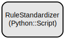

# Fractal Communication Framework: A Meta-Cognitive System for Recursive Thought Processing

The Fractal Communication Framework (FCF) is a sophisticated system that implements recursive thought processing with meta-cognitive monitoring capabilities. It provides a modular architecture for building conversational AI applications that can adapt their responses through reflection, anchoring, and synthesis while maintaining awareness of their own cognitive processes.

The framework integrates biopsychological principles with software engineering patterns to create a system that can engage in meaningful dialogue while monitoring its own cognitive load, attention allocation, and processing efficiency. It supports both synchronous and streaming interactions, with built-in safety validation and comprehensive metrics tracking.

## Repository Structure
```
grok-mem/                      # Main FCF implementation directory
├── src/                       # Source code
│   ├── main/
│   │   ├── java/             # Java implementation
│   │   │   └── com/fractalcommunication/
│   │   │       ├── controller/    # API endpoints and request handling
│   │   │       ├── model/         # Core data models
│   │   │       └── service/       # Business logic and processing
│   │   └── python/           # Python implementation
│   │       └── com/fractalcommunication/
│   │           ├── anchor.py      # Therapeutic anchor implementations
│   │           ├── interfaces.py  # Core interfaces
│   │           └── orchestrator.py # Main conversation orchestrator
│   └── test/                 # Test suites
│       ├── java/             # Java tests
│       └── python/           # Python tests
├── anthropic_project/        # Integration with Anthropic's API
└── cosmo-neuro-junction/     # Complexity analysis system
```

## Usage Instructions
### Prerequisites
- Python 3.8+
- Java 17+
- Maven or Gradle
- Anthropic API key (for Claude integration)

For C++ components:
- CMake 3.15+
- C++17 compliant compiler:
  - GCC 7+ or
  - Clang 6+ or
  - MSVC 2019+

### Installation

#### Python Installation
```bash
# Clone the repository
git clone https://github.com/yourusername/fractal-communication-framework.git
cd fractal-communication-framework

# Create and activate virtual environment
python -m venv venv
source venv/bin/activate  # On Windows: venv\Scripts\activate

# Install dependencies
pip install -r requirements.txt
```

#### Java Installation
```bash
# Build with Maven
mvn clean install

# Or with Gradle
./gradlew build
```

### Quick Start
1. Initialize the framework components:
```python
from com.fractalcommunication.orchestrator import Orchestrator
from com.fractalcommunication.metrics import SimpleMetricsLogger

# Create orchestrator with default components
orchestrator = Orchestrator(metrics_logger=SimpleMetricsLogger())
```

2. Process a conversation:
```python
response = orchestrator.run_conversation(
    user_input="How can I express disagreement without causing tension?",
    user_id="user123",
    session_id="session456"
)
print(response)
```

### More Detailed Examples
1. Using custom anchors:
```python
from com.fractalcommunication.anchor import CustomAnchor

custom_anchor = CustomAnchor(
    name="empathy",
    description="Promotes understanding through perspective-taking"
)
orchestrator.anchor_module.register_anchor(custom_anchor)
```

2. Handling interruptions:
```python
response = orchestrator.interrupt(
    state=conversation_state,
    reason="Detected emotional escalation"
)
```

### Troubleshooting
1. Memory Issues
- Symptom: `OutOfMemoryError` during conversation processing
- Solution: Adjust memory settings in `config.yaml`:
```yaml
memory:
  max_history_size: 100
  cleanup_threshold: 0.8
```

2. Performance Issues
- Enable debug logging:
```python
import logging
logging.basicConfig(level=logging.DEBUG)
```
- Monitor metrics:
```python
metrics = orchestrator.metrics_logger.get_all_metrics()
print(metrics)
```

## Data Flow
The framework processes conversations through a recursive chain of thought pattern.

```ascii
User Input → Reflection Engine → Anchor Selection → Synthesis → Response
     ↑                                                            |
     |                        Memory Module                       |
     └────────────────────────────────────────────────────────┘
```

Key component interactions:
- Reflection Engine analyzes input using meta-cognitive patterns
- Anchor Module selects appropriate therapeutic anchors based on context
- Synthesis Module combines reflection and anchored response
- Memory Module maintains conversation history and user profiles
- Metrics Logger tracks performance and cognitive load metrics

## Quality Assurance Pipeline

The project implements a comprehensive quality assurance pipeline that enforces code quality standards and ensures reliable integration across modules.

### Quality Gates

All code must pass the following quality gates before being merged:

1. **Static Code Analysis**
   - Checkstyle: Enforces code style and formatting standards
   - PMD: Identifies potential bugs and suboptimal code
   - SpotBugs: Detects potential bugs through bytecode analysis

2. **Testing**
   - Unit Tests: Must cover at least 80% of code
   - Integration Tests: End-to-end functionality verification
   - Test reports are generated in `build/reports/tests`

3. **Code Coverage**
   - JaCoCo generates coverage reports
   - Minimum 80% coverage required
   - Reports available in `build/reports/jacoco`

4. **Security**
   - OWASP Dependency Check for vulnerability scanning
   - Fails build if CVSS score >= 7.0
   - Reports in `build/reports/dependency-check`

### Running Quality Checks

```bash
# Run all quality checks
./gradlew qualityCheck

# Run specific checks
./gradlew check
./gradlew test
./gradlew integrationTest
./gradlew jacocoTestReport
./gradlew dependencyCheckAnalyze
```

### Integration Standards

1. **Module Integration**
   - Modules must communicate through well-defined interfaces
   - Integration tests required for cross-module functionality
   - Version compatibility documented in `gradle.properties`

2. **Dependency Management**
   - Central version management in root project
   - Regular dependency updates and security patches
   - Compatibility matrix maintained for major versions

3. **Build Process**
   - Reproducible builds using Gradle wrapper
   - Consistent Java version across modules
   - Automated CI/CD pipeline integration

## Infrastructure


The system uses several key infrastructure components:

Lambda Functions:
- `ThoughtProcessor`: Handles recursive thought processing
- `MetaCognitiveMonitor`: Tracks cognitive load and adaptation

Storage:
- DynamoDB Tables:
  - `conversation-history`: Stores conversation records
  - `user-profiles`: Maintains user preferences and interaction styles
  - `metrics`: Logs system performance and cognitive metrics

## Deployment
1. Prerequisites:
- AWS CLI configured
- Terraform installed
- Docker installed

2. Deploy infrastructure:
```bash
cd infrastructure
terraform init
terraform apply
```

3. Deploy application:
```bash
./deploy.sh --environment production
```